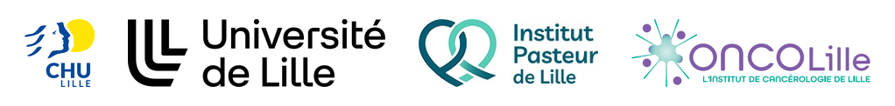

# Benjamin Podvin | PharmD, PhD Candidate

### Medical Biologist and Academic Researcher in Hematology

  

  <a href="https://www.chu-lille.fr/">CHU Lille</a>
  &nbsp;·&nbsp;
  <a href="https://www.univ-lille.fr/">University of Lille</a>
  &nbsp;·&nbsp;
  <a href="https://pasteur-lille.fr/">Institut Pasteur de Lille</a>
  &nbsp;·&nbsp;
  <a href="https://www.oncolille.eu/">ONCOLille</a>

  <a href="https://pasteur-lille.fr/equipe-recherche/perstim-lab-tumor-persistence-and-immune-response-in-hematological-malignancies/">
    PERSTIM Lab — Tumor Persistence and Immune Response in Hematological Malignancies
  </a>

---

## About me

I am a medical biologist and assistant professor in hematology at Lille University Hospital and the University of Lille.

My work starts from clinical and laboratory observations and combines cytomorphology, flow cytometry, molecular biology and genomic approaches to investigate the biology of hematologic malignancies.

My main research interests are multiple myeloma, myeloid neoplasms, molecular hematology and the development of clinically relevant biomarkers.

I am a European Hematology Exam certificate holder.

---

## Clinical and scientific expertise

### Diagnostic hematology

My clinical activity focuses on the integrated diagnosis of hematologic malignancies using:

- Peripheral blood and bone marrow cytomorphology
- Flow cytometry and immunophenotyping
- Molecular hematology
- Cytogenetic and genomic interpretation
- Integrated biological and clinical data
- Diagnostic algorithm development

### Multiple myeloma

My research focuses on the biological heterogeneity of multiple myeloma and its evolution under therapeutic pressure.

Current topics include:

- Circulating tumor cells and liquid biopsy
- Tumor dissemination outside the bone marrow
- BCMA expression and antigen escape
- `TNFRSF17` genomic alterations
- Resistance to BCMA-directed immunotherapies
- Retreatment after CAR T-cell and bispecific antibody therapy
- Immune remodeling during bispecific antibody treatment
- Biomarkers derived from genomic, transcriptomic and proteomic data

### Myeloid neoplasms

I study unusual molecular and biological presentations of myeloid malignancies, with a particular interest in:

- `e1a2` / p190 `BCR::ABL1` chronic myeloid leukemia
- BCR::ABL1 breakpoint and junction architecture
- Co-mutation profiles and clonal persistence
- Clonal evolution and molecular relapse

---

## Current research projects

### BCMA genomic alterations and therapeutic resistance

Genomic and functional characterization of `TNFRSF17` alterations associated with resistance to BCMA-directed immunotherapies.

The objective is to understand how BCMA alterations affect therapeutic binding and whether genomic profiling can help guide subsequent treatment selection.

### Circulating tumor cells in multiple myeloma

Study of circulating plasma cells as biomarkers of tumor dissemination, spatial heterogeneity, prognosis and treatment response.

This work explores whether peripheral blood can provide a representative and minimally invasive view of multiple myeloma biology.

### p190 BCR::ABL1 chronic myeloid leukemia

Characterization of the clinical, cytological and molecular features of chronic myeloid leukemia carrying the `e1a2` BCR::ABL1 transcript.

This project includes breakpoint and junction sequence analyses, associated mutation profiles, single-cell analyses and longitudinal clonal dynamics.

### Immune response to multiple myeloma therapies

Study of immune and inflammatory remodeling during treatment with bispecific antibodies and other immunotherapies.

This work integrates cellular, genomic, transcriptomic and proteomic measurements to identify determinants of deep and sustained response.

### Integrated diagnosis of hematological diseases

Development and evaluation of diagnostic approaches combining morphology, flow cytometry, automated hematology parameters and molecular findings.

---

## Methods used in my research

### Cellular and diagnostic methods

- Peripheral blood and bone marrow cytology
- Flow cytometry
- Immunophenotyping
- Plasma-cell characterization
- Circulating tumor-cell detection
- Integrated hematologic diagnosis

### Molecular and genomic methods

- Molecular diagnostics
- Quantitative PCR / ddPCR
- Targeted DNA sequencing
- Whole-genome sequencing
- Bulk RNA sequencing
- Single-cell RNA sequencing
- Single-cell DNA sequencing
- Mission Bio Tapestri analyses
- Variant interpretation
- Copy-number alteration analysis
- Structural variant analysis
- Breakpoint and junction reconstruction
- Fusion transcript characterization
- Clonal evolution analysis
- Mutational signature analysis
- Neoantigen prediction

### Proteomic and immune profiling

- Olink proteomics
- Soluble biomarker measurement
- Immune-cell profiling
- Longitudinal biomarker analyses
- Integration of cellular and molecular data

These approaches are used to answer biological and clinical questions rather than as standalone technical objectives.

---

## Data analysis and computational tools

  

  &nbsp;&nbsp;

  

  &nbsp;&nbsp;

  

  &nbsp;&nbsp;

  

I use computational tools to support biological interpretation, statistical analysis, data visualization and reproducible research.

My work notably includes:

- Statistical analysis and publication-ready visualization using R
- Data processing and workflow development using Python
- Genomic variant annotation and biological interpretation
- Copy-number, structural variant and junction sequence analyses
- Bulk and single-cell transcriptomic analyses
- Single-cell DNA sequencing data analysis
- Integration of genomic, transcriptomic, proteomic and clinical data
- Biomarker discovery and survival analyses
- Version control and collaborative research using Git and GitHub

These tools support my clinical and biological research questions rather than constituting a standalone bioinformatics activity.
---

## Selected publications

### Multiple myeloma

- [TNFRSF17 genomic profiling guides retreatment with alternative BCMA-directed immunotherapies in multiple myeloma](https://pubmed.ncbi.nlm.nih.gov/42418388/)  
  Blood Advances, 2026

- [Circulating Tumor Cells in Multiple Myeloma: From Peripheral Clues to Central Insights](https://pubmed.ncbi.nlm.nih.gov/41974595/)  
  American Journal of Hematology, 2026

### Molecular and diagnostic hematology

- [NPM1 mutation subtype switch in acute myeloid leukemia](https://pubmed.ncbi.nlm.nih.gov/40109189/)  
  Haematologica, 2025

- [A New Diagnostic Approach for Myelodysplastic Neoplasms Using a Combination of Scores Based on Flow Cytometry and Automated Hematology Sysmex XN Analyzers](https://pubmed.ncbi.nlm.nih.gov/39658949/)  
  International Journal of Laboratory Hematology, 2025

- [Oligomonocytic chronic myelomonocytic leukemia is eligible to MDS-score and not Mono-dysplasia score](https://pubmed.ncbi.nlm.nih.gov/38644333/)  
  International Journal of Laboratory Hematology, 2024

- [A new combination of monocytic scores to support diagnosis of chronic myelomonocytic leukemia according to novel classifications](https://pubmed.ncbi.nlm.nih.gov/36967295/)  
  International Journal of Laboratory Hematology, 2023

- [Chronic myeloid leukaemia presenting with monocytosis](https://pubmed.ncbi.nlm.nih.gov/34409591/)  
  British Journal of Haematology, 2022

- [Subclonal acquisition of a BCR::ABL1 fusion in a chronic myelomonocytic leukemia](https://pubmed.ncbi.nlm.nih.gov/35562492/)  
  Annals of Hematology, 2022

---

## Scientific profiles

- [ORCID](https://orcid.org/0000-0002-0616-8694)
- [PubMed](https://pubmed.ncbi.nlm.nih.gov/?term=Benjamin+Podvin)
- [PERSTIM Lab](https://pasteur-lille.fr/equipe-recherche/perstim-lab-tumor-persistence-and-immune-response-in-hematological-malignancies/)
- [LinkedIn](https://fr.linkedin.com/in/benjamin-podvin-67b3b0125)

---

## Contact

Lille, France  
[benjamin.podvin@chu-lille.fr](mailto:benjamin.podvin@chu-lille.fr)

